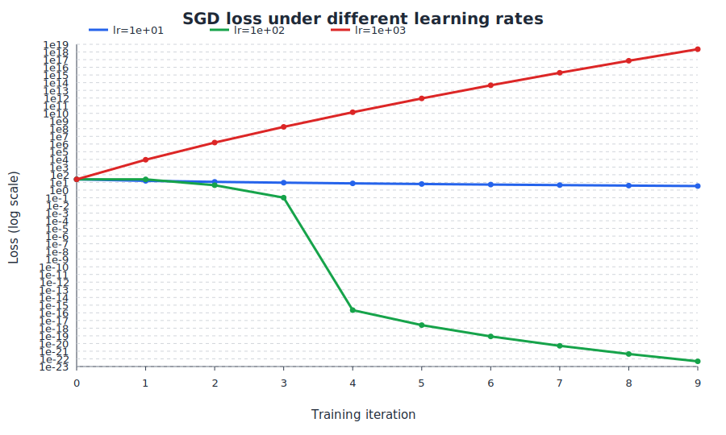
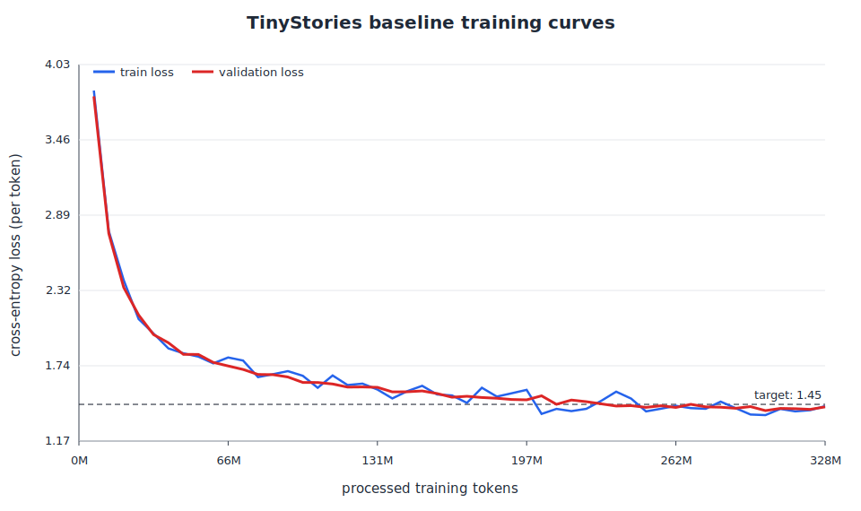
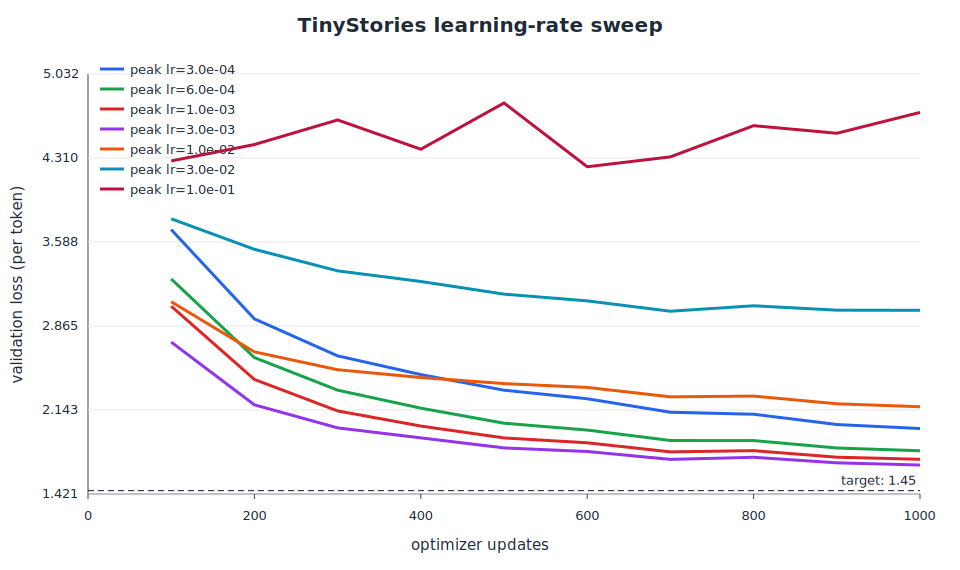
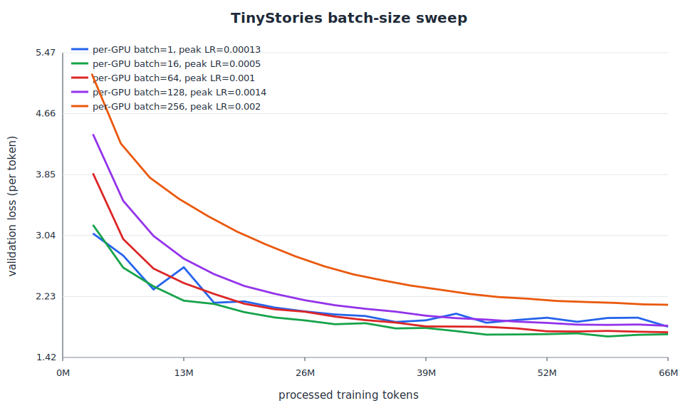
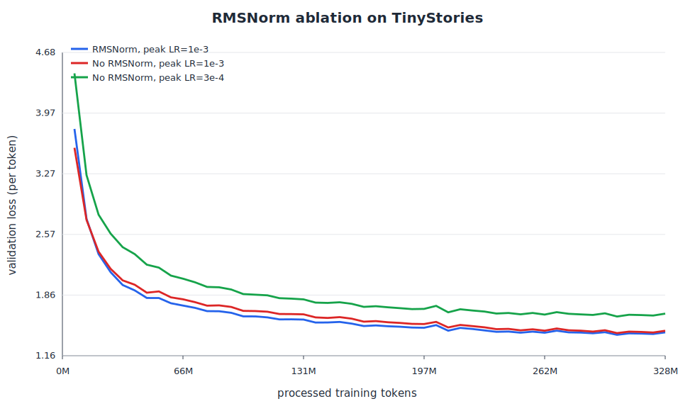
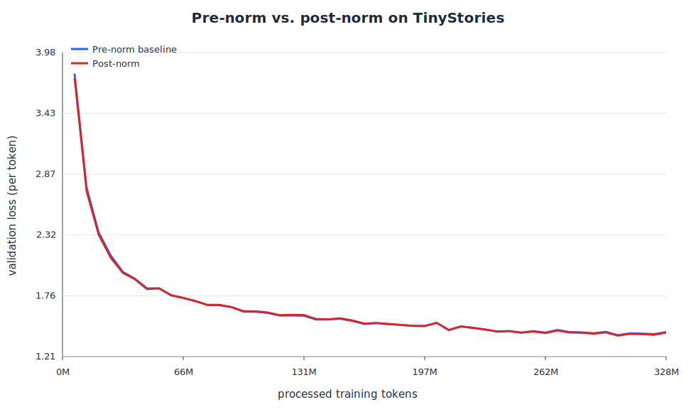
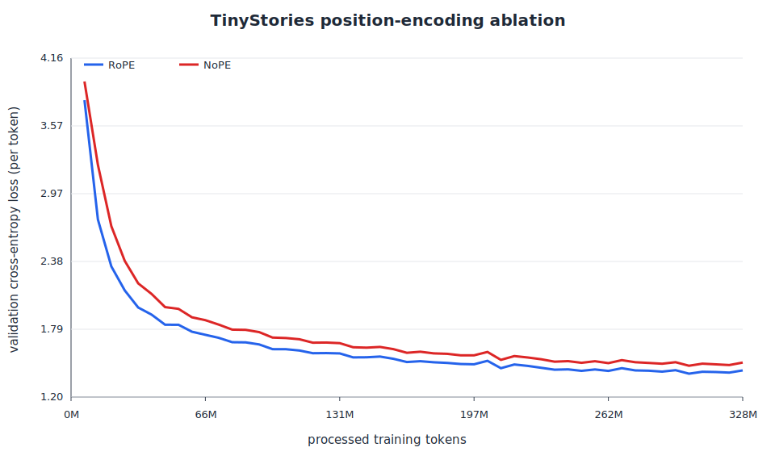
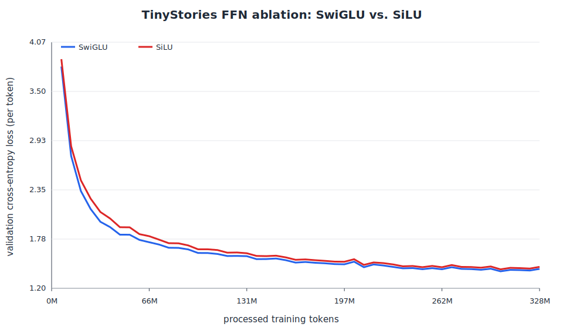
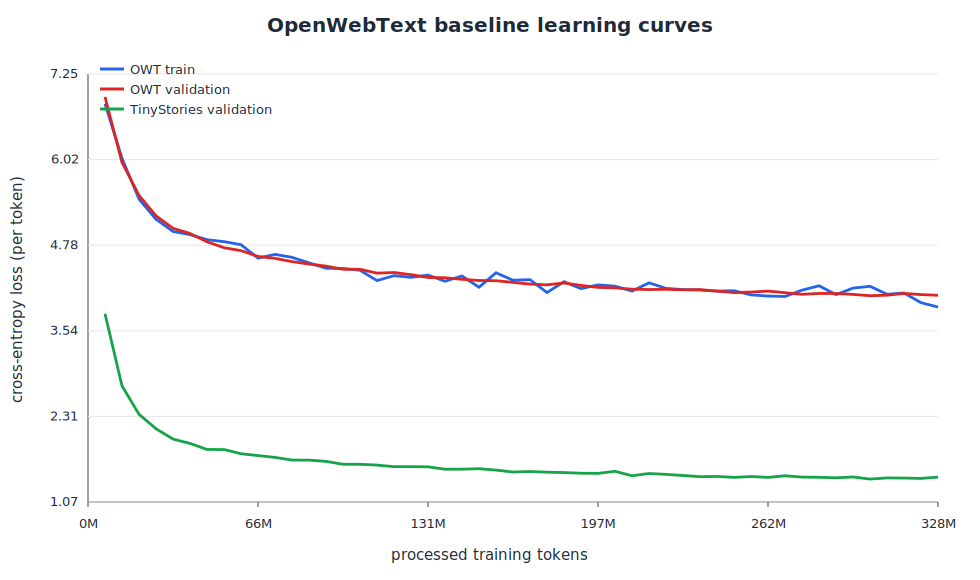

# A1：Basics of Language Modeling and Tokenization

## 基本信息

- 姓名：徐颢诚
- GitHub ID：`VegTea`
- 作业题面版本：SummerQuest 2026 A1（26.0.4）/ Stanford CS336 Assignment 1（26.0.3）
- 上游 starter commit：`a158843b20107949f1a8d7df1b05cd33b9166712`
- 完成范围：Tokenizer、Transformer、训练基础设施、TinyStories/OWT 主实验、学习率与 batch size sweep、四个架构消融和文本生成
- 未完成项：无

## 提交内容与复现说明

- 真实实现位于 `submission/cs336_basics/`，21 个公共测试接口位于 `submission/tests/adapters.py`。
- 数据处理、训练、消融和生成入口位于 `submission/scripts/`，公开训练配置位于 `submission/configs/`。
- `logs/` 保存报告所用 run 的逐点 JSONL 指标和汇总 JSON；`assets/` 保存报告引用的 SVG 曲线。
- 依赖和公共测试由官方兄弟仓库 `assignment1-basics` 提供，不在个人提交中复制数据、checkpoint、虚拟环境或依赖锁。
- 在官方工作仓库中安装依赖并验证实现：`uv sync --frozen && uv run pytest`。各实验的具体命令列在对应章节。

## 飞书补充文档

- 组织内补充材料入口：[Lecture 3 Notes](https://fudan-nlp.feishu.cn/docx/RnQHdXpenohtd1xSMGCcykWznab?from=from_copylink)

以下为完整书面题与实验报告。

## Problem (unicode1): Understanding Unicode

> (a) What Unicode character does chr(0) return?

它返回 Unicode 码点 U+0000 对应的 NUL 控制字符，在 Python 字面表示中写作 `\x00`。

> (b) How does this character’s string representation (__repr__()) differ from its printed representation?

它的 `__repr__()` 为 `'\x00'`，会显式展示转义形式；`print` 会实际输出这个不可见控制字符，因此终端上看不到字形。

> (c) What happens when this character occurs in text?

NUL 仍然是字符串中的真实字符，会占据一个位置并增加字符串长度，只是在普通终端输出中不可见；某些使用 NUL 结尾字符串的 C 接口还可能把它误当作文本终止位置。

## Problem (unicode2): Unicode Encodings (3 points)

> (a) What are some reasons to prefer training our tokenizer on UTF-8 encoded bytes, rather than UTF-16 or UTF-32?
> It may be helpful to compare the output of these encodings for various input strings.

UTF-8 与 ASCII 向后兼容，对英文和常见网页文本通常比 UTF-16/UTF-32 更紧凑，而且不存在字节序问题；它也是互联网文本的主流编码。更短的 byte 序列通常意味着 tokenizer 输入更短，从而减少后续模型计算，但 UTF-8 并非对所有语言都一定比 UTF-16 更短。

> (b) Consider the following (incorrect) function, which is intended to decode a UTF-8 byte string into
> a Unicode string. Why is this function incorrect? Provide an example of an input byte string
> that yields incorrect results.
> def decode_utf8_bytes_to_str_wrong(bytestring: bytes):
> return "".join([bytes([b]).decode("utf-8") for b in bytestring])

例如 `"牛".encode("utf-8") == b"\xe7\x89\x9b"` 会抛出 `UnicodeDecodeError`。原函数错误地逐个 byte 解码，而一个 UTF-8 字符可能由多个 byte 共同组成，必须拼成完整 byte sequence 后再解码。

> (c) Give a two byte sequence that does not decode to any Unicode character(s).

`b"\xff\xff"` 无法按 UTF-8 解码，因为 `0xFF` 不是合法的 UTF-8 起始或续接 byte。

## Problem (train_bpe_tinystories): BPE Training on TinyStories (2 points)
>
> (a) Train a byte-level BPE tokenizer on the TinyStories dataset, using a maximum vocabulary size
> of 10,000. Make sure to add the TinyStories <|endoftext|> special token to the vocabulary.
> Serialize the resulting vocabulary and merges to disk for further inspection. How many hours
> and memory did training take? What is the longest token in the vocabulary? Does it make sense?
> Resource requirements: ≤30 minutes (no GPUs), ≤ 30GB RAM
> Hint You should be able to get under 2 minutes for BPE training using multiprocessing during
> pretokenization and the following two facts:
>
> (a) The <|endoftext|> token delimits documents in the data files.
>
> (b) The <|endoftext|> token is handled as a special case before the BPE merges are applied.

使用32进程进行预分词

训练完成：生成 9,743 条 merge 规则。

训练时间：54.81 秒，即约 0.0152 小时

峰值内存：377,464 KiB，即约 368.6 MiB

最长 token 字节数：15

最长 token：[b' accomplishment', b' disappointment', b' responsibility']

``` text
uv run python scripts/train_tinystories_bpe.py
Elapsed (wall clock) time (h:mm:ss or m:ss): 0:55.01
Maximum resident set size (kbytes): 377464
```

> (b) Profile your code. What part of the tokenizer training process takes the most time?

预分词阶段32并行，主要瓶颈在于merge阶段，占据了 50s 的时间

## Problem (train_bpe_expts_owt): BPE Training on OpenWebText (2 points)

> (a) Train a byte-level BPE tokenizer on the OpenWebText dataset, using a maximum vocabulary
> size of 32,000. Serialize the resulting vocabulary and merges to disk for further inspection. What
> is the longest token in the vocabulary? Does it make sense?
> Resource requirements: ≤12 hours (no GPUs), ≤ 100GB RAM

训练完成：生成 31,743 条 merge 规则

训练完成，耗时：239.35 分钟，即约 3.99 小时

峰值内存：8,554,056 KiB，即约 8.16 GiB

词表大小：32,000

merge 数量：31,743

结果已保存到：artifacts/owt_bpe_32k.pkl

最长 token 字节长度：64

最长 token（bytes）：

  b'\xc3\x83\xc3\x82\xc3\x83\xc3\x82\xc3\x83\xc3\x82\xc3\x83\xc3\x82\xc3\x83\xc3\x82\xc3\x83\xc3\x82\xc3\x83\xc3\x82\xc3\x83\xc3\x82\xc3\x83\xc3\x82\xc3\x83\xc3\x82\xc3\x83\xc3\x82\xc3\x83\xc3\x82\xc3\x83\xc3\x82\xc3\x83\xc3\x82\xc3\x83\xc3\x82\xc3\x83\xc3\x82'

  b'----------------------------------------------------------------'

最长 token（UTF-8 尝试解码）：

  'ÃÂÃÂÃÂÃÂÃÂÃÂÃÂÃÂÃÂÃÂÃÂÃÂÃÂÃÂÃÂÃÂ'

  '----------------------------------------------------------------'

Command being timed: "uv run python scripts/train_owt_bpe.py"

User time (seconds): 15564.09

System time (seconds): 127.78

Percent of CPU this job got: 109%

Elapsed (wall clock) time (h:mm:ss or m:ss): 3:59:21

Average shared text size (kbytes): 0

Maximum resident set size (kbytes): 8554056

最长 token 的长度为 64 bytes。其中连续 64 个 `-` 很可能来自 Markdown 的水平分隔线或网页排版，
因此是合理的高频模式；另一个 token 解码为重复的 `ÃÂ`，更可能是网页文本中字符编码错误（mojibake）
反复出现造成的字节模式，而不是自然语言中的词。

> (b) Compare and contrast the tokenizer that you get training on TinyStories versus OpenWebText.

两个 tokenizer 具有较大的重合度：TinyStories 词表中有 7,321 个 token 出现在 OpenWebText 词表中，
5,177 条 merge 也出现在 OpenWebText 的 merges 中。这说明二者都学习了英语的常见字节模式、子词和标点。
不过 TinyStories 的最长 token 是 `b' accomplishment'`、`b' disappointment'` 和
`b' responsibility'` 等常见叙事词汇；OpenWebText 则学习到网页格式分隔线和编码异常等更杂乱的模式，
反映了网页语料更广泛、更嘈杂的文本分布。

比较时还应注意，OpenWebText tokenizer 的词表大小为 32K，而 TinyStories tokenizer 只有 10K；
因此 OpenWebText tokenizer 的覆盖能力不仅来自训练语料更丰富，也部分来自更大的词表。

## Problem (tokenizer_experiments): Experiments with tokenizers (4 points)

> (a) Sample 10 documents from TinyStories and OpenWebText. Using your previously-trained TinyS-
> tories and OpenWebText tokenizers (10K and 32K vocabulary size, respectively), encode these
> sampled documents into integer IDs. What is each tokenizer’s compression ratio (bytes/token)?

```bash
uv run python scripts/tokenizer_compression_experiment.py
```

各种情况压缩率如下表所示：

| Dataset        | TinyStories Tokenizer | OpenWebText Tokenizer |
|----------------|-----------------------|-----------------------|
| TinyStories    | 4.2003                | 4.0792                |
| OpenWebText    | 3.0537                | 4.1549                |

> (b) What happens if you tokenize your OpenWebText sample with the TinyStories tokenizer? Com-
> pare the compression ratio and/or qualitatively describe what happens.

TinyStories tokenizer 将 OpenWebText 样本编码为 48,778 个 token，压缩率仅为 3.0537 bytes/token；

OpenWebText tokenizer 对同一批文本只需 35,850 个 token，压缩率为 4.1549 bytes/token。也就是说，
使用 TinyStories tokenizer 会多产生约 36% 的 token，说明儿童故事语料训练出的较小词表难以覆盖网页文本中
更丰富的词汇、专有名词和格式模式。

相反，在 TinyStories 样本上，TinyStories 10K tokenizer 的压缩率
略高于 OpenWebText 32K tokenizer（4.2003 对 4.0792），体现了同域训练的优势。

> (c) Estimate the throughput of your tokenizer (e.g., in bytes/second). How long would it take to
> tokenize the Pile dataset (825GB of text)?
>

输入文件：data/TinyStoriesV2-GPT4-valid.txt

输入大小：22,502,601 bytes

token 数：5,461,210

耗时：23.08 秒

吞吐量：0.98 MB/s

吞吐量：0.93 MiB/s

按此单进程吞吐量处理 825GB Pile 的预计时间：235 小时

好在是该过程是可以并行的，我也编写了并行的tokenize脚本encode_datasets.py, 默认是32进程，吞吐量可以达28MB/s

> (d) Using your TinyStories and OpenWebText tokenizers, encode the respective training and
> development datasets into a sequence of integer token IDs. We’ll use this later to train our language
> model. We recommend serializing the token IDs as a NumPy array of datatype uint16. Why is
> uint16 an appropriate choice?

uint16 可以表示从 0 到 65535 的整数范围，而我们的词汇表大小分别为 10,000 和 32,000，绰绰有余。

## Problem (transformer_accounting): Transformer LM resource accounting (5 points)
>
> (a) Consider GPT-2 XL, which has the following configuration:
> vocab_size : 50,257
> context_length : 1,024
> num_layers : 48
> d_model : 1,600
> num_heads : 25
> d_ff : 4,288
> Suppose we constructed our model using this configuration. How many trainable parameters
> would our model have? Assuming each parameter is represented using single-precision floating
> point, how much memory is required to just load this model?

设 `V = 50,257`、`L = 48`、`H = 1,600`、`D_ff = 4,288`。这里的 `D_ff` 是最接近
`8H/3` 的 64 的整数倍。输入 embedding 和输出 LM head
在本作业架构中不共享权重；RoPE 的 sin/cos 是固定 buffer，不计入可训练参数。

| 模块 | 参数量公式 | 参数量 |
|---|---:|---:|
| Token embedding | `V × H` | 80,411,200 |
| Attention（每层 Q/K/V/O） | `4H²` | 10,240,000 |
| SwiGLU（每层 W1/W2/W3） | `3D_ff × H` | 20,582,400 |
| 两个 RMSNorm（每层） | `2H` | 3,200 |
| 单个 Transformer block | `4H² + 3D_ff × H + 2H` | 30,825,600 |
| 48 个 Transformer blocks | `48 × 30,825,600` | 1,479,628,800 |
| Final RMSNorm | `H` | 1,600 |
| LM head | `V × H` | 80,411,200 |
| **总计** |  | **1,640,452,800** |

因此模型约有 `1.640 × 10^9` 个可训练参数。FP32 每个参数占 4 bytes，加载参数本身需要
`1,640,452,800 × 4 = 6,561,811,200` bytes，即约 **6.56 GB**（十进制）或
**6.11 GiB**（二进制）。

> (b) Identify the matrix multiplies required to complete a forward pass of our GPT-2 XL-shaped
> model. How many FLOPs do these matrix multiplies require in total? Assume that our input
> sequence has context_length tokens.

以下按 batch size 为 1、序列长度 `S = 1,024` 计算；一个矩阵乘法 `m × k` 乘以
`k × n` 计为 `2mkn` FLOPs。Embedding lookup、RMSNorm、RoPE、SiLU、softmax 和残差连接
不是矩阵乘法，因此不计入下表。

| 矩阵乘法 | 单层 FLOPs | 48 层 FLOPs |
|---|---:|---:|
| Q、K、V、输出投影 | `8SH² = 20.972` GFLOPs | 1.007 TFLOPs |
| `QK^T` | `2S²H = 3.355` GFLOPs | 0.161 TFLOPs |
| Attention weights × V | `2S²H = 3.355` GFLOPs | 0.161 TFLOPs |
| SwiGLU 的 W1/W2/W3 | `6SHD_ff = 42.153` GFLOPs | 2.023 TFLOPs |
| 最终 LM head | `2SHV` | 0.165 TFLOPs |
| **总计** |  | **3.517 TFLOPs** |

其中 attention 全部计算（四个投影、`QK^T`，以及 attention weights 与 V 的乘法）合计约
**1.329 TFLOPs**。

> (c) Based on your analysis above, which parts of the model require the most FLOPs?

SwiGLU 前馈网络占用最多计算量：约 2.023 TFLOPs，占总 FLOPs 的约 **57.5%**。Attention 占约
1.329 TFLOPs（约 **37.8%**），最终 LM head 占约 0.165 TFLOPs（约 **4.7%**）。因此，在该模型规模
和上下文长度下，前馈网络是主要的矩阵乘法计算瓶颈。

> (d) Repeat your analysis with GPT-2 small (12 layers, 768 d_model, 12 heads), GPT-2 medium (24
> layers, 1024 d_model, 16 heads), and GPT-2 large (36 layers, 1280 d_model, 20 heads). As the
> model size increases, which parts of the Transformer LM take up proportionally more or less of
> the total FLOPs?

对每个模型，`D_ff` 都取最接近 `8H/3` 的 64 的整数倍，因此 Small、Medium、Large 和 XL 分别使用
`D_ff = 2048, 2752, 3392, 4288`。以下 FLOPs 单位均为 TFLOPs：

| Model | Attention | SwiGLU | LM Head | Total | Attention % | SwiGLU % | Head % |
|---|---:|---:|---:|---:|---:|---:|---:|
| Small | 0.097 | 0.116 | 0.079 | 0.292 | 33.13% | 39.76% | 27.10% |
| Medium | 0.309 | 0.416 | 0.105 | 0.830 | 37.25% | 50.05% | 12.70% |
| Large | 0.676 | 0.960 | 0.132 | 1.769 | 38.25% | 54.30% | 7.45% |
| XL | 1.329 | 2.023 | 0.165 | 3.517 | 37.78% | 57.53% | 4.68% |

随着模型的增大：

- LM head 随 `H` 线性增长，而 block 的投影和 FFN 主要随 `H²` 增长，因此其占比从 27.10% 降至 4.68%；
- Attention 占比从 33.13% 小幅增至 37.78%；
- SwiGLU 占比从 39.76% 增至 57.53%，在更大的模型中成为更主要的计算开销。

> (e) Take GPT-2 XL and increase the context length to 16,384. How does the total FLOPs for one
> forward pass change? How do the relative contribution of FLOPs of the model components
> change?

当 context length 从 1,024 增至 16,384（16 倍）时，单次 forward 的矩阵乘法计算量从
**3.517 TFLOPs** 增至 **133.578 TFLOPs**，约增加 **38.0 倍**。其中 `QK^T` 和 attention weights × V
随 `S²` 增长，总计达到 82.463 TFLOPs；attention 的总占比从 37.78% 增至 **73.79%**。相比之下，
SwiGLU 和 LM head 随 `S` 线性增长，占比分别降至 24.24% 和 1.97%。因此，长上下文下二次复杂度的
attention 矩阵乘法成为主要计算瓶颈。

## Problem (learning_rate_tuning): Tuning the learning rate (1 point)
>
> As we will see, one of the hyperparameters that affects training the most is the learning rate. Let’s
> see that in practice in our toy example. Run the SGD example above with three other values for the
> learning rate: 1e1, 1e2, and 1e3, for just 10 training iterations. What happens with the loss for each
> of these learning rates? Does it decay faster, slower, or does it diverge (i.e., increase over the course of
> training)

```bash
uv run python scripts/learning_rate_tuning.py
```
实测结果：
lr=1e1：loss 从 24.94 平稳下降到 3.35，但下降较慢。
lr=1e2：前一步 loss 基本不变，之后迅速降到接近 0，是三者中下降最快且稳定的。
lr=1e3：loss 从 24.94 升至 9,002，随后爆炸到 2.31e18，明显发散。



随着学习率变大，loss 下降得更快，但当学习率过大时（如 1e3），loss 在训练过程中会发散。

## Problem (adamw_accounting): Resource accounting for training with AdamW (2 points)

> Let us compute how much memory and compute running AdamW requires. Assume FP32 for every tensor.

### (a) Peak memory

设 `B = batch_size`、`S = context_length`、`N = num_layers`、`H = d_model`、`A = num_heads`、
`V = vocab_size`，并设 `D = d_ff = 8H/3`。模型参数数量为：

```text
P = 2VH + N(4H² + 3DH + 2H) + H
```

其中 `2VH` 是输入 embedding 与 LM head；每个 block 包含四个 attention 投影、三个 SwiGLU
矩阵和两个 RMSNorm 权重。每个 FP32 元素占 4 bytes。

| 项目 | FP32 元素数量 | 内存 |
|---|---:|---:|
| Parameters | `P` | `4P` bytes |
| Gradients | `P` | `4P` bytes |
| AdamW state（m 与 v） | `2P` | `8P` bytes |
| Activations | `BSH + N(8BSH + 4BSD + 2BAS²) + BSV + BS` | 4 倍该表达式 bytes |

外层 `BSH` 是 final RMSNorm。每个 block 的 `8BSH` 来自两个 RMSNorm、QKV、
attention 输出和 output projection；`4BSD` 来自 W1、W3、SiLU/门控中间结果；`2BAS²` 来自 attention
score 与 softmax；`BSV` 是 logits，`BS` 是逐 token 的交叉熵损失。

```text
M_peak = 16P + 4[BSH + N(8BSH + 4BSD + 2BAS²) + BSV + BS] bytes
```

将 `D = 8H/3` 代入后，activation 项是：

```text
BSH + N(56/3 × BSH + 2BAS²) + BSV + BS
```

### (b) GPT-2 XL 与 80GB

使用 `V=50,257`、`S=1,024`、`N=48`、`H=1,600`、`A=25`、`D=4,266.67`：

```text
P = 1,635,537,600 parameters
static memory = 16P = 26.169 GB
activation memory per batch item = 16.151 GB
M_peak(B) = 26.169 + 16.151B GB
```

```text
B <= (80 - 26.169) / 16.151 = 3.33
```

因此最大整数 batch size 为 **3**。这只是题目指定的简化激活模型；实际训练还会有 CUDA allocator、
临时 workspace、通信缓冲区等额外开销。

### (c) 一次 AdamW training step 的 FLOPs

单个序列的一次 forward matrix-multiply FLOPs 为：

```text
F = N(8SH² + 4S²H + 6SDH) + 2SHV
```

其中三项依次是 attention projections、attention 的两个矩阵乘法、SwiGLU 的三个矩阵乘法，最后一项是
LM head。Backward FLOPs 按题意是 forward 的两倍，因此 batch size 为 `B` 的模型 forward 加 backward 是
`3BF`。忽略只按 step 计算一次的标量系数，AdamW 对每个参数约执行 2 次 weight-decay 操作、3 次一阶矩
更新、4 次二阶矩更新和 5 次自适应更新，共约 `14P` 次标量 FLOPs，故：

```text
F_step = 3BF + 14P
```

通常 `3BF` 远大于 `14P`，所以模型 forward/backward 是主要计算开销。

### (d) 50% MFU 的单卡 H100 训练时间

当前 PDF 使用 H100 的 495 TFLOP/s。对上述 GPT-2 XL 配置，单个长度 1,024 序列的 forward 为
`F = 3.507 TFLOPs`。取 batch size 1,024：

```text
每 step FLOPs ≈ 3 × 1,024 × 3.507 TFLOPs = 10.773 PFLOPs
50% MFU 吞吐量 = 0.5 × 495 TFLOP/s = 247.5 TFLOP/s
总时间 = 400,000 × 10.773 PFLOPs / 247.5 TFLOP/s
         ≈ 4,836 小时 ≈ 201.5 天
```

AdamW 的标量更新相对每 step 的约 10.773 PFLOPs 可以忽略。因此，单张 H100 以 50% MFU 训练
400K steps 约需 **202 天**。

## Problem (training_together): Put it together (4 points)

我在四张 RTX 4090 上训练 TinyStories baseline。每卡 batch size 为 64，因此 global batch size 为 256；
训练 5,000 steps、context length 为 256，共处理 **327,680,000 tokens**。训练日志、checkpoint 与完整配置
保存在 `logs/ts_baseline/2026-07-15/08-16-44/`。

| 配置项 | 值 |
|---|---:|
| `d_model` / layers / heads / `d_ff` | 512 / 4 / 16 / 1344 |
| context length / vocabulary size | 256 / 10,000 |
| AdamW peak LR / min LR | 1e-3 / 6e-5 |
| warmup / cosine cycle | 250 / 5,000 steps |
| weight decay / gradient clipping | 0.01 / 1.0 |
| 每卡 batch / global batch | 64 / 256 |
| 训练步数 / processed tokens | 5,000 / 327,680,000 |



训练耗时 **791.18 秒（约 13.2 分钟）**。最终 per-token validation loss 为 **1.4309**，满足不高于
1.45 的要求。loss 在整体上稳定下降；验证曲线在训练后期有少量随机波动，但在 3,600 step 后已多次低于
1.45，最终 checkpoint 也保持在该阈值以下。

4 卡 4090 训练命令：

```bash
CUDA_VISIBLE_DEVICES=0,1,2,3 scripts/run_with_host_nvidia.sh torchrun --standalone --nproc_per_node=4 scripts/train_lm.py --config-name TS_baseline1
```

## Problem (learning_rate): Tune the learning rate (2 B200 hrs) (3 points)

在四张 GPU 上，每卡 batch size 为 64（global batch size 为 256），每个 run 训练 1,000 steps，
共处理 65,536,000 tokens。前 50 steps 线性 warmup；之后令 `min_lr = max_lr`，使 LR 保持不变，
避免 cosine decay 掩盖高 LR 的不稳定性。

```bash
# 先启动3e-4, 6e-4, 1e-3, 3e-3, 1e-2的sweep, 查看loss变化
CUDA_VISIBLE_DEVICES=0,1,2,3 scripts/run_with_host_nvidia.sh python scripts/run_lr_sweep.py --phase full --nproc-per-node 4 --execute
# 1e-2 虽表现较差但仍下降；继续增加 lr，测试 3e-2 和 1e-1 以寻找发散点
CUDA_VISIBLE_DEVICES=0,1,2,3 scripts/run_with_host_nvidia.sh python scripts/run_lr_sweep.py --phase edge --nproc-per-node 4 --execute
```

### (a) Perform a hyperparameter sweep over the learning rates and report the final losses (or note divergence if the optimizer diverges)



| Warmup 后的固定 LR | 最终 validation loss | 现象 |
|---:|---:|---|
| 3e-4 | 1.9840 | 稳定但收敛较慢 |
| 6e-4 | 1.7927 | 收敛更快 |
| 1e-3 | 1.7194 | 继续改善 |
| **3e-3** | **1.6701** | 本次短预算 sweep 中最快的稳定收敛 |
| 1e-2 | 2.1710 | 仍下降，但明显更慢且停在较差 loss |
| 3e-2 | 3.0003 | 在约 3.0 附近震荡/停滞，未能有效收敛 |
| 1e-1 | 4.7017 | 验证 loss 从 4.284 总体升至 4.702，并持续大幅震荡；视为发散 |

我先以对数间隔测试 `3e-4` 到 `1e-2`，以覆盖过小、可能最优和明显过大的 LR；由于 `1e-2`
仍然缓慢下降而非真正发散，继续测试 `3e-2` 和 `1e-1`。所有 run 使用相同模型、数据、seed、global
batch、训练 steps 和 warmup，因此曲线差异主要来自学习率。

### (b) Folk wisdom is that the best learning rate is “at the edge of stability.” Investigate how the point at which learning rates diverge is related to your best learning rate.

随着 LR 从 `3e-4` 增至 `3e-3`，同一 token 预算内的最终 loss 持续降低，说明更大的稳定 LR 带来更快的
收敛；但继续增至 `1e-2` 后收敛显著变慢，`3e-2` 已停滞，`1e-1` 则出现总体上升且强烈震荡的发散曲线。
因此最佳稳定 LR 位于发散边界之前：本 sweep 中 `3e-3` 最好，而 `1e-2` 已显示超过该区域的代价。实际的
正式训练仍使用 cosine decay，并应在 `1e-3` 到 `3e-3` 附近进一步细调 peak LR。

## Problem (batch_size_experiment): Batch size variations (1 B200 hr) (1 point)
> Vary your batch size all the way from 1 to the GPU memory limit. Try at least a few batch sizes in between, including typical sizes like 64 and 128.

> Deliverable: Learning curves for runs with different batch sizes. The learning rates should be
optimized again if necessary.

> Deliverable: A few sentences discussing your findings on batch sizes and their impacts on
training.

我在四张 RTX 4090 上测试了每卡 batch size `1, 16, 64, 128, 256`。为公平比较，每组均固定训练
65,536,000 processed tokens；因此 batch 越大，训练 steps 越少。模型架构、数据、seed、weight decay 与
cosine schedule 的相对形状保持一致。以 baseline 的 global batch=256、peak LR=1e-3 为锚点，我采用
AdamW 的平方根缩放 `lr = 1e-3 × sqrt(global_batch / 256)` 重新设定各组的初始 peak LR。



| 每卡 batch | Global batch | Steps | Peak LR | Final validation loss | 训练时间 |
|---:|---:|---:|---:|---:|---:|
| 1 | 4 | 64,000 | 1.25e-4 | 1.8317 | 19.3 min |
| **16** | 64 | 4,000 | 5e-4 | **1.7315** | 2.9 min |
| 64 | 256 | 1,000 | 1e-3 | 1.7583 | 2.8 min |
| 128 | 512 | 500 | 1.41e-3 | 1.8436 | 3.2 min |
| 256 | 1,024 | 250 | 2e-3 | 2.1232 | 3.8 min |

在固定 token 预算下，batch=16 的最终 validation loss 最低。batch=1 有最多的参数更新，但梯度噪声较大，
而且墙钟时间远长于其他设置；batch 增至 128 和 256 时，更新次数分别降至 500 和 250，即使按平方根规则
提高 LR，收敛仍明显变差。结果表明中等 batch 在吞吐量、梯度噪声和更新次数之间取得了更好的平衡。这里的
256 是本次**最大已测试**每卡 batch，512就OOM了。

## Problem (generate): Generate text (1 point)

我使用 baseline checkpoint `logs/ts_baseline/2026-07-15/08-16-44/latest.pt`，以
`<|endoftext|>Once upon a time` 为 prompt，设置 `temperature=0.8`、`top_p=0.9`、seed=42，
最多生成 256 个新 token。模型在生成第 169 个新 token 时输出 `<|endoftext|>`；完整 dump 保存于
`logs/ts_baseline/2026-07-15/08-16-44/generation.txt`。

```text
<|endoftext|>Once upon a time, there was a big, strong cat named Tom. Tom lived in a small house with his best friend, a little girl named Lily. They liked to play together all day long.
One day, Tom and Lily were playing in the yard. Tom saw a tiny bug on the ground. He wanted to catch it, but he was too small. So, Tom ran and jumped to catch the bug. The bug crawled onto his back legs, and he could see it was time to catch it.
Lily saw the bug and waved her hand in the air. She jumped back and tried to catch it. Tom chased the bug, but it was too fast. They both laughed and played together, enjoying the day. In the end, Tom and Lily became the best of friends, and they always played together in the yard.
<|endoftext|>
```

输出具有清晰的角色、场景和“开头—事件—结尾”的 TinyStories 叙事结构，整体可读；但仍有重复表达，且
“the bug crawled onto his back legs”一类局部语义不自然。质量主要受以下因素影响：(1) 模型规模、训练 token
预算和 checkpoint 的 validation loss 决定语言规律是否学得充分；(2) temperature 与 top-p 决定采样的随机性，
温度或 nucleus 过大更有创意但更容易产生不连贯文本，过小则容易重复；此外 prompt 的内容和长度也会约束后续
故事的主题与一致性。

## Problem (layer_norm_ablation): Remove RMSNorm and train (0.5 B200 hrs) (1 point)
> Remove all of the RMSNorms from your Transformer and train. What happens at the previous optimal learning rate? Can you get stability by using a lower learning rate?
> Deliverable: A learning curve for when you remove RMSNorms and train, as well as a learning curve for the best learning rate.
> Deliverable: A few sentences of commentary on the impact of RMSNorm.

我将每个 Transformer block 中 attention 和 FFN 前的 RMSNorm，以及最后一个输出 RMSNorm，全部替换为
恒等映射。其余设置与 baseline 完全一致：四张 GPU、global batch=256、5,000 steps，每组均处理
327,680,000 tokens。首先使用此前最优 peak LR `1e-3`，然后将 peak LR 降至 `3e-4`；两组均使用相同比例的
warmup 和 cosine decay。



| 模型 | Peak LR | Final validation loss | 训练时间 |
|---|---:|---:|---:|
| Baseline（有 RMSNorm） | 1e-3 | **1.4309** | 791.2 s |
| 无 RMSNorm | 1e-3 | 1.4496 | 753.1 s |
| 无 RMSNorm | 3e-4 | 1.6481 | 753.7 s |

移除 RMSNorm 后，原最优 LR `1e-3` 并未发散，训练曲线仍然稳定，但最终 validation loss 比 baseline 高约
0.0187。将 LR 降至 `3e-4` 同样能够稳定训练，却在固定 token 预算内收敛得明显更慢，因此不是更好的 LR。
在这个较浅的四层模型以及启用全局梯度裁剪的条件下，RMSNorm 不是避免数值发散的必要条件；但它改善了优化
效果和最终泛化性能。去除 RMSNorm 也减少了少量计算，使训练时间约缩短 4.8%。

## Problem (pre_norm_ablation): Implement post-norm and train (0.5 B200 hrs) (1 point)

> Modify your pre-norm Transformer implementation into a post-norm one. Train with the post-
> norm model and see what happens.
>
> Deliverable: A learning curve for a post-norm Transformer, compared to the pre-norm one.

我将 baseline block 的 pre-norm 更新

```text
z = x + Attention(RMSNorm(x))
y = z + FFN(RMSNorm(z))
```

改为 post-norm 更新

```text
z = RMSNorm(x + Attention(x))
y = RMSNorm(z + FFN(z))
```

其余设置均与 TinyStories baseline 相同：相同初始化 seed、4 层模型、RoPE、SwiGLU、global batch=256、
peak LR `1e-3`、cosine schedule、梯度裁剪和 5,000 steps。两组都处理 327,680,000 tokens，因此曲线
差异只来自 RMSNorm 在残差分支中的位置。

```bash
CUDA_VISIBLE_DEVICES=0,1,2,3 uv run python \
  scripts/run_postnorm_ablation.py --nproc-per-node 4 --execute

uv run python scripts/plot_postnorm_ablation.py \
  --postnorm logs/ablation_postnorm/2026-07-15/13-18-56/metrics.jsonl
```



| Norm 位置 | 最终 validation loss | 最低 validation loss | 最后 5 次验证均值 | 训练时间 |
|---|---:|---:|---:|---:|
| Pre-norm | 1.4309 | 1.4025（step 4,600） | 1.4163 | 791.18 s |
| Post-norm | **1.4254** | **1.3982**（step 4,600） | **1.4108** | 793.33 s |

Post-norm 在本实验中没有发散，两条曲线在整个训练过程中非常接近。post-norm 的最终 loss 比 pre-norm 低
0.0054，最低 loss 低 0.0042，最后 5 次验证均值低 0.0054；这些差值相对于单次验证波动很小，因此更合理的
结论是两者在该设置下性能基本相当，而不是 post-norm 明显更优。这个结果也不与深层 Transformer 通常偏好
pre-norm 的经验矛盾：本模型只有 4 层，并启用了 warmup 和全局梯度裁剪，优化问题远比深层模型温和。
pre-norm 的主要优势是改善深层网络中的梯度传播和训练稳定性，而这种优势在当前浅层、小规模实验中不一定
明显。

## Problem (no_pos_emb): Implement NoPE (1 point)

> Modify your Transformer implementation with RoPE to remove the position embedding information
> entirely, and see what happens.
>
> Deliverable: A learning curve comparing the performance of RoPE and NoPE.

我在 TinyStories baseline 上进行位置编码消融。RoPE 对照直接使用
`logs/ts_baseline/2026-07-15/08-16-44/`，NoPE 仅关闭 Q、K 上的 rotary embedding，仍保留 causal
attention mask；模型架构、初始化 seed、数据、global batch、优化器、学习率调度、训练步数及验证设置均与
baseline 相同。因此，两组都训练 5,000 steps、处理 327,680,000 tokens。

```bash
uv run python scripts/run_nope_ablation.py --nproc-per-node 4 --execute

uv run python scripts/plot_nope_ablation.py \
  --rope logs/ts_baseline/2026-07-15/08-16-44/metrics.jsonl \
  --nope logs/ablation_nope/2026-07-15/10-44-14/metrics.jsonl \
  --output assets/tinystories_rope_vs_nope.svg
```



| 位置编码 | 最终 validation loss | 最低 validation loss | 最后 5 次验证均值 | 训练时间 |
|---|---:|---:|---:|---:|
| RoPE | **1.4309** | **1.4025**（step 4,600） | **1.4163** | 791.18 s |
| NoPE | 1.4994 | 1.4717（step 4,600） | 1.4846 | 772.41 s |

NoPE 可以稳定训练，说明 causal mask 本身提供的不对称性使 decoder-only Transformer 即使没有显式位置编码，
也能学到一部分顺序信息。然而它在几乎整条训练曲线上都落后于 RoPE：最终 loss 高 **0.0686**（约 4.8%），
最后 5 次验证的均值也高 0.0683。两组的单次验证均有随机采样波动，但最低 loss 和末 5 次均值给出一致结论：
在相同 token 预算下，显式的相对位置信息能提高样本效率和最终语言建模性能；移除 RoPE 并不会导致发散，
但会造成清晰、持续的性能损失。

## Problem (swiglu_ablation): SwiGLU vs. SiLU (1 point)

> Deliverable: A learning curve comparing the performance of SwiGLU and SiLU feed-forward
> networks, with approximately matched parameter counts.
>
> Deliverable: A few sentences discussing your findings.

我将 baseline 的 gated SwiGLU
`W2(SiLU(W1x) ⊙ W3x)` 替换为不含门控的 `W2(SiLU(W1x))`。为近似匹配参数量，SwiGLU 沿用
`d_ff=1344`，每层 FFN 参数量为 `3×512×1344=2,064,384`；SiLU 按题目要求使用
`d_ff=4×d_model=2048`，每层 FFN 参数量为 `2×512×2048=2,097,152`。两者 FFN 参数量仅相差
1.59%，完整模型分别有 22,696,448 和 22,827,520 个参数，相差约 0.58%。

除 FFN 类型与为参数匹配所需的 inner dimension 外，SiLU run 与 `logs/ts_baseline/2026-07-15/08-16-44/`
使用相同数据、seed、RoPE、RMSNorm、global batch=256、优化器、学习率调度和 5,000-step 训练预算；两组均
处理 327,680,000 tokens。

```bash
uv run python scripts/run_swiglu_ablation.py --nproc-per-node 4 --execute

uv run python scripts/plot_swiglu_ablation.py \
  --swiglu logs/ts_baseline/2026-07-15/08-16-44/metrics.jsonl \
  --silu logs/ablation_silu/2026-07-15/11-17-39/metrics.jsonl \
  --output assets/tinystories_swiglu_vs_silu.svg
```



| FFN | `d_ff` | 模型参数量 | 最终 validation loss | 最低 validation loss | 最后 5 次验证均值 | 训练时间 |
|---|---:|---:|---:|---:|---:|---:|
| SwiGLU | 1,344 | 22,696,448 | **1.4309** | **1.4025**（step 4,600） | **1.4163** | 791.18 s |
| SiLU | 2,048 | 22,827,520 | 1.4543 | 1.4256（step 4,600） | 1.4395 | 785.01 s |

在参数量和训练 token 预算近似相同的条件下，SwiGLU 的最终 validation loss 比 SiLU 低 0.0234（约
1.61%）；最低 loss 低 0.0231，最后 5 次验证均值低 0.0233，三个指标的结论一致。SiLU 也能稳定训练，且
差距小于移除 RoPE 的实验，但曲线后半段整体仍略逊于 SwiGLU。这说明收益并非来自更多参数：SiLU 的参数甚至
略多，而带乘法门控的 SwiGLU 仍取得更好的语言建模性能。在本次浅层 TinyStories 模型和固定预算下，门控带来
了稳定但幅度不大的样本效率与最终性能提升。

## Problem (main_experiment): Experiment on OWT (2 B200 hrs) (2 points)

> Train your language model on OpenWebText with the same model architecture and total training
> iterations as TinyStories. How well does this model do?
>
> Deliverable: A learning curve of your language model on OpenWebText. Describe the difference
> in losses from TinyStories – how should we interpret these losses?
>
> Deliverable: Generated text from OpenWebText LM, in the same format as the TinyStories
> outputs. How is the fluency of this text? Why is the output quality worse even though we have
> the same model and compute budget as TinyStories?

OWT baseline 沿用 TinyStories baseline 的模型架构和训练迭代数：`d_model=512`、4 层、16 个头、
`d_ff=1344`、context length 256，并使用 RMSNorm、RoPE 和 SwiGLU。训练同样使用 4 张 GPU、每卡
batch size 64（global batch 256）和 5,000 steps，因此两组都处理了 327,680,000 tokens。主要区别是将
数据换成 OpenWebText，并使用对应的 32K BPE tokenizer，所以 embedding 和输出层的词表维度由 10K 增至
32K。优化器使用 AdamW，peak LR 为 `1e-3`，前 250 steps warmup，之后 cosine decay 至 `6e-5`。

```bash
CUDA_VISIBLE_DEVICES=0,1,2,3 scripts/run_with_host_nvidia.sh \
  torchrun --standalone --nproc_per_node=4 scripts/train_lm.py \
  --config-name OWT_baseline
```



| 数据集 | 词表大小 | Steps | Processed tokens | Final validation loss | Perplexity | 训练时间 |
|---|---:|---:|---:|---:|---:|---:|
| TinyStories | 10,000 | 5,000 | 327,680,000 | **1.4309** | 4.18 | 791.2 s |
| OpenWebText | 32,000 | 5,000 | 327,680,000 | **4.0572** | 57.81 | 1129.2 s |

OWT 的 validation loss 明显更高，但这并不表示实现有误。Per-token cross-entropy 衡量模型对下一个
token 的不确定性；TinyStories 的语言、主题和叙事模板较单一，而 OWT 包含新闻、论坛、网页、技术文章等
多种领域，词汇和写作风格更加多样，条件熵自然更高。此外，两者使用不同 tokenizer 和词表，token 的粒度及
预测类别数不同，因此 loss 不能作为完全等价的跨数据集质量指标；它主要适合比较同一 tokenizer、同一数据集
上的模型。32K 词表还增大了 embedding/output projection，使 OWT run 在相同步数下耗时约多 43%。

我使用最终 checkpoint，以 `<|endoftext|>In recent years,` 为 prompt，设置 `temperature=0.8`、
`top_p=0.9` 和 seed 42，生成 256 个新 token（未提前生成 `<|endoftext|>`）。完整结果也保存在
`logs/owt_baseline/2026-07-15/11-32-12/generation.txt`。

```text
<|endoftext|>In recent years, the U.S. government has decided to stay in the U.S. for an ongoing and comprehensive plan to increase Internet access.

In its effort to get the work done, the government has to consider a new strategy to address the most important issues facing Internet access.

The United States government has repeatedly asked the government to improve the approach of the telecommunications security program, but which has seen an increasing impact on internet access and internet access.

In a 2013 memo that gave the government a wide range of policy priorities, the U.S. government said in a statement to the European Parliament that the government had set a goal of “collaborating the internet to all Internet access and services.”

The U.S. government said the U.S. government had worked to reduce the ability to open an internet access and control of communications communications, with the government concerned that the government had not let ISPs be in the country for a long time.

“The government has taken up the idea of creating the Internet, to identify all internet access and ensure that any user can access the internet access, by using the U.S. government to obtain Internet access,” the memo said.

The government has also put forward a plan to increase the
```

输出在表面形式上较流畅：具有新闻文体、多个段落、引语及相对一致的 Internet-access 主题，也基本符合英语
语法；但内容缺少真实的信息推进，频繁重复 `government` 和 `Internet access`，还出现
“communications communications”等退化现象，整体连贯性明显弱于 TinyStories 输出。相同模型和 token
预算在 OWT 上效果更差，主要因为：(1) OWT 的领域、词汇、事实和文体远比高度模板化的 TinyStories 多样，
需要更大的模型容量和更多训练数据才能覆盖；(2) 32K 词表使 embedding 和输出层更大，也令每个 token 的
预测问题更难，在相同计算预算下可用于学习每种模式的有效样本更少；(3) 仅 4 层、context length 256 的模型
难以学习网页文章中的长距离结构。temperature、top-p 与 prompt 也会影响单次样本，但不能弥补训练容量和
数据覆盖上的不足。
