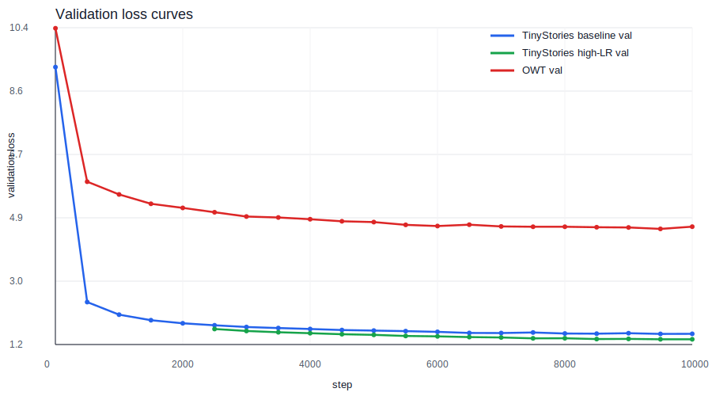

# A1 公开提交：胡宸

## 实现说明

- `model.py`：Linear、Embedding、RMSNorm、SwiGLU、SiLU FFN、RoPE、masked scaled dot-product attention、causal MHA、Transformer block、Transformer LM、stable softmax、cross-entropy。
- `tokenizer.py`：GPT-2 regex pre-tokenization、byte-level BPE 训练、special token 边界处理、encode/decode、streaming `encode_iterable`。
- `optim.py`：from-scratch AdamW。
- `training.py`：random token batch、cosine schedule、global gradient clipping。
- `serialization.py`：model/optimizer/iteration checkpoint 保存与恢复。

`submission/tests/adapters.py` 保留公共测试的 21 个 adapter 函数签名，只转发到真实实现。

## 复现脚本

基础脚本：

- `submission/scripts/train_tokenizer.py`：训练 BPE tokenizer。
- `submission/scripts/encode.py`：把文本编码成 `uint16`/`uint32` token id 文件。
- `submission/scripts/train_lm.py`：训练 Transformer LM，支持 mmap、validation、checkpoint、resume 和 ablation 参数。
- `submission/scripts/generate.py`：temperature + top-p 自回归生成。
- `submission/scripts/evaluate_lm.py`：checkpoint 评估和生成样例。

实验入口：

- `submission/scripts/run_tinystories_gpu_experiments.sh`：TinyStories baseline、四个架构消融、LR sweep、batch-size sweep 和样例生成。
- `submission/scripts/run_tinystories_target45_experiments.sh`：TinyStories valid loss 1.45 目标改进实验。
- `submission/scripts/run_owt_gpu_full_experiment.sh`：OWT tokenizer/encode/full-model train/generate 链路。
- `submission/scripts/run_required_gpu_experiments.sh`：顺序执行 TinyStories 实验、OWT encode、OWT 训练。
- `submission/scripts/run_cpu_training.sh`、`run_cpu_eval.sh`、`run_full_cpu_experiment.sh`：CPU smoke 和低资源复现入口。


## 书面题

### Unicode

- `unicode1`：`chr(0)` 返回空字符 NUL，`repr(chr(0))` 显示为 `'\x00'`，直接 `print` 时不可见；夹在普通字符串中时不会显示成可读字符，但它真实占据一个字符位置，例如 `"this is a test" + chr(0) + "string"` 的长度会增加 1。
- `unicode2(a)`：UTF-8 对 ASCII 兼容且英文文本只用 1 byte/字符，实际网页和数据集里更紧凑；UTF-16/UTF-32 会引入大量 0 byte 或固定宽度开销，还需要处理 endian/BOM 等细节。训练 byte-level tokenizer 时，UTF-8 的 256 byte 基础词表仍可无 OOV 表示任意 Unicode 文本。
- `unicode2(b)`：逐 byte 调用 `decode("utf-8")` 是错的，因为一个 Unicode 字符可能由多个 byte 组成；例如 `"牛".encode("utf-8") == b"\xe7\x89\x9b"`，单独解码第一个 byte `b"\xe7"` 会报错，而整体解码才得到 `"牛"`。
- `unicode2(c)`：`b"\xff\xff"` 是一个不能解码为合法 UTF-8 字符的两 byte 序列，因为 `0xff` 不是合法 UTF-8 起始 byte。

### AdamW 显存、FLOPs 与训练时间

AdamW 使用 fp32 时，每个参数需要参数、梯度、一阶矩和二阶矩四份张量，忽略 activation 时是 `16 * num_parameters` bytes。若按题面要求把 activation 也计入，可写作：

```text
P = 2 * vocab_size * d_model
  + num_layers * (4 * d_model^2 + 3 * d_model * d_ff + 2 * d_model)
  + d_model

A ~= batch_size * context_length *
     (num_layers * (8 * d_model + 4 * d_ff) + d_model + 2 * vocab_size)
   + batch_size * num_layers * 2 * num_heads * context_length^2

peak_bytes ~= 4 * (4P + A)
```

对题面 GPT-2 XL 形状（`vocab_size=50257`，`context_length=1024`，48 层，`d_model=1600`，25 heads，`d_ff=4288`），参数量为 1,640,452,800，fp32 参数本身约 6.11 GiB，参数+梯度+AdamW 状态约 24.44 GiB；按上面的 activation 近似，峰值显存约 `15.25 GiB * batch_size + 24.44 GiB`，80 GiB 下最大 batch size 约为 3。

AdamW 单步逐参数更新包含 weight decay、两个 moment 更新、`sqrt/div/sub` 等逐元素操作；按每个参数约 14 FLOPs 估算，GPT-2 XL 一次 optimizer step 约 23.0 GFLOPs，远小于 Transformer 前后向计算。GPT-2 XL 在 context 1024 下单样本 forward 矩阵乘约 3.517 TFLOPs；若 batch size 1024、400K steps、反向为 forward 的 2 倍、单张 H100 以 50% MFU 使用 495 TFLOP/s 理论峰值，则训练时间约 `400000 * 1024 * 3 * 3.517e12 / (0.5 * 495e12) = 4,850` 小时，约 202 天。

## Tokenizer 与编码

| 数据集 | tokenizer vocab | train raw bytes | train tokens | train bytes/token | valid raw bytes | valid tokens | valid bytes/token | longest token |
| --- | ---: | ---: | ---: | ---: | ---: | ---: | ---: | --- |
| TinyStories | 10,000 | 2,227,753,162 | 540,793,471 | 4.119 | 22,502,601 | 5,461,167 | 4.120 | 15 bytes (` accomplishment`, ` disappointment`, ` responsibility`) |
| OpenWebText | 32,000 | 11,920,511,059 | 262,963,181 | 45.331 | 289,998,753 | 66,401,098 | 4.367 | 64 bytes (`----------------------------------------------------------------`, mojibake repeat token) |

TinyStories tokenizer 训练约 9.2 分钟，吞吐约 4.04 MB/s；train split 编码约 60.3 分钟，吞吐约 149.6k tokens/s；valid split 编码约 39 秒，吞吐约 140.0k tokens/s。OWT 32K tokenizer 训练从 2026-07-14 11:45:06 UTC 到 2026-07-15 05:03:40 UTC，约 17.3 小时，训练 tokenizer 的原始文本吞吐约 191 KB/s；按 encoded 文件 mtime 估算，OWT train 编码约 76.4 分钟、57.4k tokens/s，valid 编码约 53.6 分钟、20.6k tokens/s。OWT train/valid 编码后的 `.bin` 文件用于后续 GPU 训练。


## 模型规模与计算

TinyStories/OWT full-model 架构相同：context length 256，`d_model=512`，`d_ff=1344`，4 layers，16 heads，RoPE theta 10000，Pre-Norm RMSNorm，SwiGLU FFN。实现使用 untied token embedding 和 LM head。

| 配置 | vocab | 参数量 | fp32 参数内存 | AdamW 训练状态估算 |
| --- | ---: | ---: | ---: | ---: |
| TinyStories full model | 10,000 | 22,696,448 | 86.6 MiB | 0.338 GiB |
| OWT full model | 32,000 | 45,224,448 | 172.5 MiB | 0.674 GiB |

参数公式：

```text
2 * vocab_size * d_model
+ num_layers * (4 * d_model^2 + 3 * d_model * d_ff + 2 * d_model)
+ d_model
```

AdamW 训练状态按 fp32 参数、梯度、一阶矩和二阶矩估算，即约 `16 * num_parameters` bytes，不含 activations、temporary tensors 和 allocator overhead。

矩阵乘法 FLOPs 采用 `2mnp` 估算。对 GPT-2 family 形状，按本作业 untied embedding/LM head、context 1024、`d_ff` 取最接近 `8/3 * d_model` 的 64 倍数估算：

| GPT-2 shape | layers | d_model | heads | d_ff | 参数量估算 | AdamW 参数+梯度+状态 | B=1,T=1024 forward FLOPs | FLOPs 主要占比 |
| --- | ---: | ---: | ---: | ---: | ---: | ---: | ---: | --- |
| small | 12 | 768 | 12 | 2048 | 162.1M | 2.42 GiB | 0.292 TFLOPs | FFN 39.8%, LM head 27.1%, attention projection 19.9%, attention quadratic 13.3% |
| medium | 24 | 1024 | 16 | 2752 | 406.5M | 6.06 GiB | 0.830 TFLOPs | FFN 50.1%, attention projection 24.8%, LM head 12.7%, attention quadratic 12.4% |
| large | 36 | 1280 | 20 | 3392 | 833.6M | 12.42 GiB | 1.769 TFLOPs | FFN 54.3%, attention projection 27.3%, attention quadratic 10.9%, LM head 7.4% |
| XL | 48 | 1600 | 25 | 4288 | 1,640.5M | 24.44 GiB | 3.517 TFLOPs | FFN 57.5%, attention projection 28.6%, attention quadratic 9.2%, LM head 4.7% |

模型变大而 context 固定时，FFN 和 projection 的占比上升，LM head 占比下降；如果把 GPT-2 XL 的 context 从 1024 增加到 16384，单样本 forward 约变为 133.6 TFLOPs，attention 的 `T^2` 部分升到约 61.7%，成为主要计算来源。

## TinyStories 训练结果

主目标配置：`batch_size=128`，`context_length=256`，`steps=10000`，processed tokens `327,680,000`。



| run | steps | batch | LR | train loss | valid loss | elapsed | tokens/sec | 结论 |
| --- | ---: | ---: | ---: | ---: | ---: | ---: | ---: | --- |
| `tinystories_gpu_baseline` | 10,000 | 128 | 3e-4 -> 3e-5 | 1.5004 | 1.5109 | 1014.2s | 323k | baseline 未达到 1.45 |
| `tinystories_gpu_target45_continue20k` | 20,000 | 128 | continued | 1.5047 | 1.4552 | 1024.0s | - | 接近但仍高于 1.45 |
| `tinystories_gpu_target45_highlr10k` | 10,000 | 128 | 3e-3 -> 3e-4 | 1.3377 | 1.3517 | 817.8s | 321k | 达到 1.45 目标 |

`target45_highlr10k` 从 `tinystories_gpu_lr_3em3.pt` 的 2000-step checkpoint 续训到 10000 step，因此表中 tokens/sec 按新增 8000 step 计算。其 validation loss 1.3517 是本次 TinyStories 主结果。

## 必做实验

完整实验摘要见 `logs/gpu-experiments.md`；规范化逐点日志见 `logs/train_tinystories.jsonl`、`logs/train_owt.jsonl`、`logs/lr_sweep/`、`logs/batch_size/`、`logs/ablation_*.jsonl` 和 `logs/summary.json`。JSONL 中每个训练 step 包含 `step`、`wall_clock_sec`、`train_loss`、`lr`，并在 validation step 包含 `valid_loss`。

架构消融均使用 TinyStories full-model 设置，除被测变量外保持 baseline 配置：

| run | 改动 | valid loss | 相对 baseline |
| --- | --- | ---: | ---: |
| baseline | Pre-Norm + RMSNorm + RoPE + SwiGLU | 1.5109 | 0.0000 |
| no RMSNorm | 删除 RMSNorm | 1.5400 | +0.0291 |
| post norm | Pre-Norm 改 Post-Norm | 1.5114 | +0.0006 |
| no RoPE | RoPE 改 NoPE | 1.6039 | +0.0930 |
| SiLU FFN | 参数量近似匹配的 SiLU FFN (`silu_d_ff=2016`) | 1.5481 | +0.0372 |

LR sweep 包含一个发散/不稳定 run：

| max LR | steps | valid loss | 观察 |
| ---: | ---: | ---: | --- |
| 1e-4 | 2,000 | 2.4335 | 明显欠训练 |
| 3e-4 | 2,000 | 1.9387 | 稳定但慢 |
| 1e-3 | 2,000 | 1.6411 | 更快收敛 |
| 3e-3 | 2,000 | 1.5629 | 本 sweep 最好，并作为 high-LR 续训 seed |
| 1e-1 | 2,000 | 3.8268 | 不稳定/发散 |

Batch sweep 覆盖 1 到 128，包括 64 和 128。batch 1-32 只跑 1000 steps；batch 64/128 跑 10000 steps，所以两组不能直接按最终 loss 比较：

| batch | steps | processed tokens | valid loss |
| ---: | ---: | ---: | ---: |
| 1 | 1,000 | 256,000 | 3.6470 |
| 2 | 1,000 | 512,000 | 3.2888 |
| 4 | 1,000 | 1,024,000 | 3.0544 |
| 8 | 1,000 | 2,048,000 | 2.8968 |
| 16 | 1,000 | 4,096,000 | 2.6904 |
| 32 | 1,000 | 8,192,000 | 2.5129 |
| 64 | 10,000 | 163,840,000 | 1.5675 |
| 128 | 10,000 | 327,680,000 | 1.5109 |

## OWT 训练与生成

OWT 使用相同 Transformer 架构，vocab size 改为 32,000，`batch_size=32`，`steps=10000`，processed tokens `81,920,000`。

| run | train tokens | valid tokens | train loss | valid loss | elapsed | tokens/sec |
| --- | ---: | ---: | ---: | ---: | ---: | ---: |
| `owt_gpu_full` | 262,963,181 | 66,401,098 | 4.6059 | 4.6234 | 395.2s | 207k |

生成样例见 `logs/generation-samples.md`。