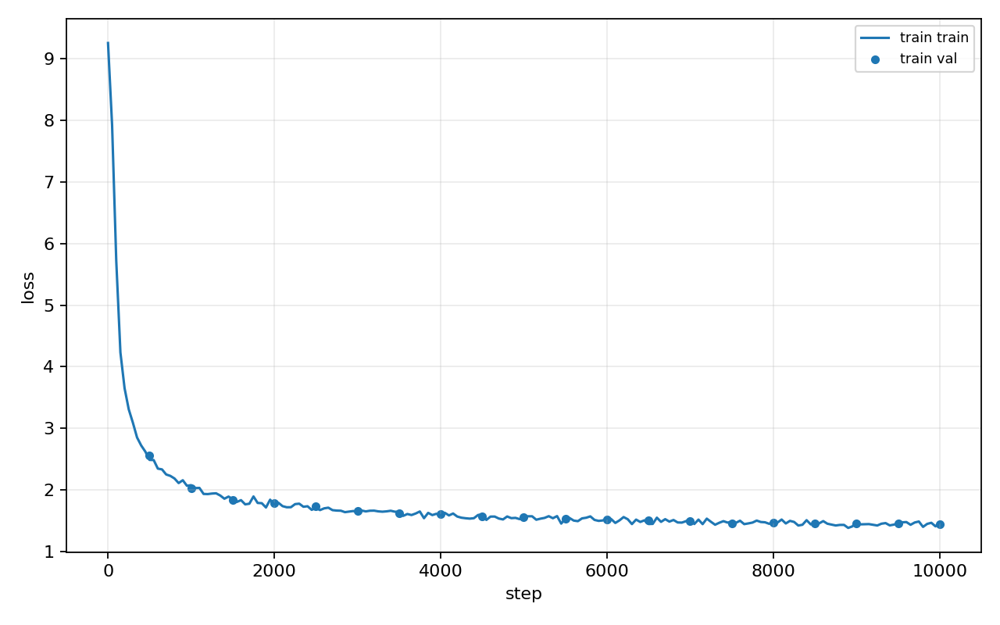
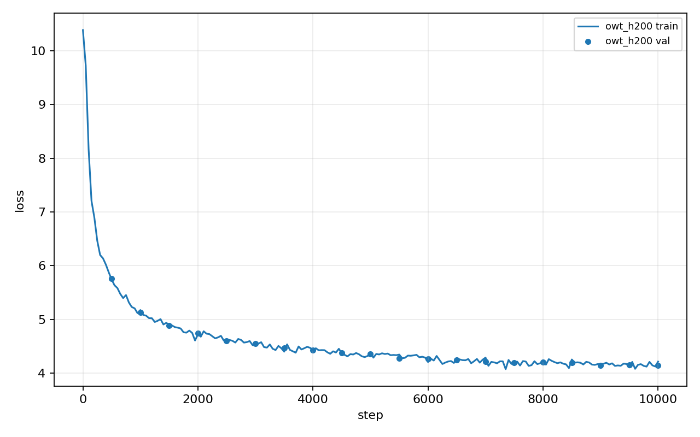
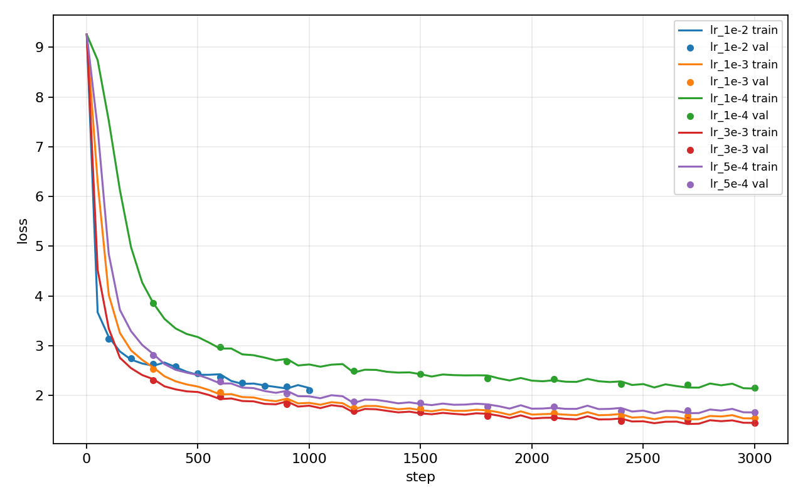
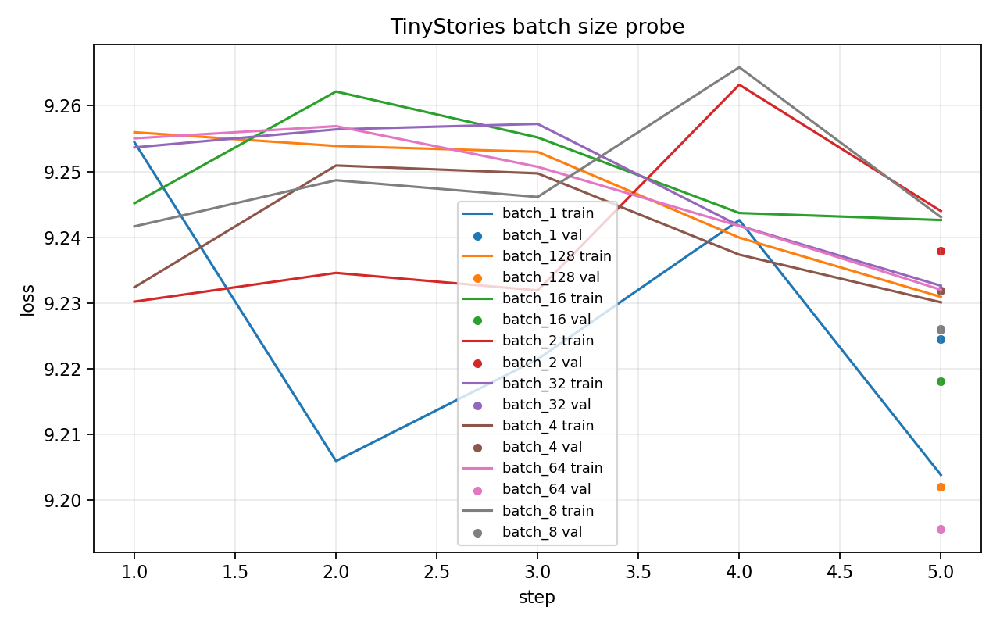
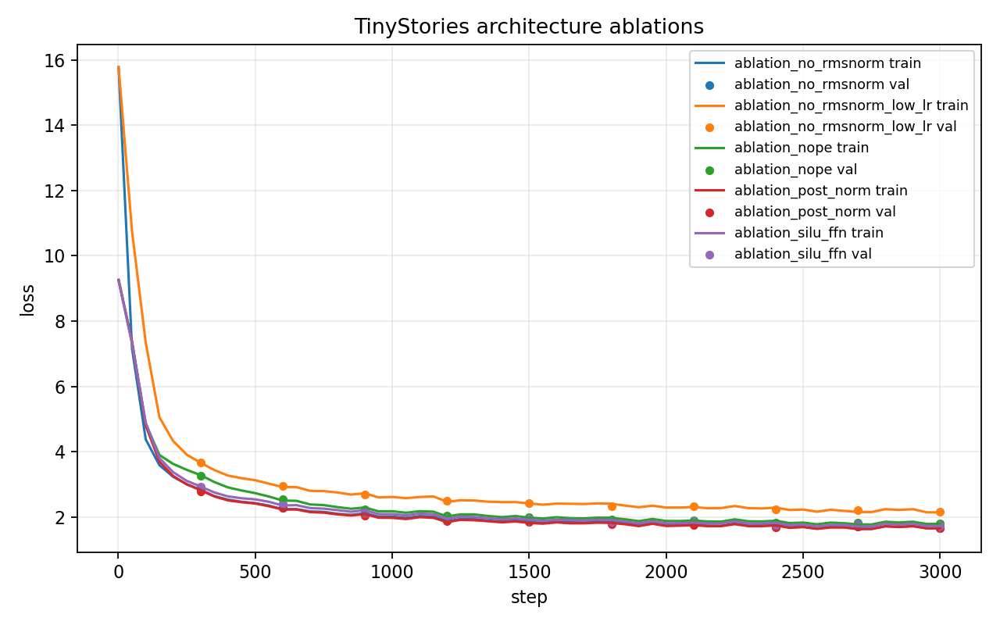

# A1 公开提交：陈博闻

> 本文件和同目录代码公开可见。只提交允许公开且已经脱敏的内容；组织内材料放在下方登记的飞书补充文档中，密钥和访问凭据不进入任何提交材料。

## 基本信息

- 作业题面版本：26.0.4
- 完成范围：21 个公共 adapter 对应的 tokenizer、Transformer、训练工具、checkpoint 和生成基础代码；训练、编码、生成脚本；轻量公开配置；TinyStories/OWT 正式训练、学习率 sweep、batch size probe、四个架构消融、loss 曲线和生成样本。
- 未完成项：无；公开提交中按规则不包含原始数据、`.npy` 编码数据、checkpoint、虚拟环境或私有机器路径凭据。
- 上游 starter commit：`a158843b20107949f1a8d7df1b05cd33b9166712`
- 本地工作仓库：`../assignment1-basics`

## 书面题

### unicode1

`chr(0)` 返回 Unicode 空字符 `U+0000`。它的 `repr` 会显示为转义形式 `'\x00'`，而直接打印时没有可见字形。空字符出现在文本中时仍然是字符串的一部分，会占据一个字符位置，但终端显示时通常看起来像什么都没有。

### unicode2

UTF-8 适合 byte-level BPE，因为它是互联网上最常见的文本编码，ASCII 文本保持单字节表示，英文和常见标点更紧凑；相比 UTF-16/UTF-32，它通常更节省空间，也不会把大量 ASCII 字符扩展成固定 2 或 4 字节。

逐 byte 单独 decode UTF-8 是错误的，因为多字节字符必须整体解码。例如 `"牛".encode("utf-8")` 是 `b"\xe7\x89\x9b"`，单独解码每个 byte 都不是合法 UTF-8 字符。一个无法解码成 Unicode 字符的两字节序列例子是 `b"\xff\xff"`，因为 `0xff` 不是合法的 UTF-8 起始字节。

### AdamW 资源核算

AdamW 对每个可训练参数至少保存参数、梯度、一阶矩 `m` 和二阶矩 `v`。若使用 fp32，单参数约需要 `4 * 4 = 16` bytes；若还保存额外 master weight 或混合精度状态，开销会更高。对于参数量为 `N` 的模型，AdamW 训练状态的主量级显存约为 `16N` bytes，不含激活、临时 attention 矩阵和 dataloader 缓冲。

矩阵乘法 `(m, n) @ (n, p)` 约为 `2mnp` FLOPs。Transformer 中 Q/K/V/O projection 和 FFN 随 batch、序列长度和 `d_model^2` 近似线性增长，attention score 与加权求和含 `T^2` 项，所以 context length 增大时 attention 计算和显存会更快成为瓶颈。训练时间可以按 `总 tokens / 实测 tokens_per_sec` 估计；正式 GPU run 中 TinyStories 处理 327.68M tokens 用时 1438.36 秒，OWT 处理 327.68M tokens 用时 2024.24 秒。

## 实现说明

`submission/cs336_basics/` 中实现了以下组件：

- byte-level BPE 训练、特殊 token 边界处理、encode/decode、流式 `encode_iterable`。
- 从零实现 `Linear`、`Embedding`、`RMSNorm`、SwiGLU、RoPE、masked scaled dot-product attention、causal multi-head attention、Transformer block 和 Transformer LM。
- 实现稳定 softmax、cross-entropy、AdamW、warmup + cosine schedule、global gradient clipping、batch sampler、checkpoint save/load。
- `generation.py` 实现 temperature 和 top-p 采样生成。

`submission/tests/adapters.py` 只保留公共 ABI 的胶水逻辑，真实实现均在 `cs336_basics/` 中。

## 代码验证

在 `../assignment1-basics` 固定工作仓库执行：

```bash
uv run pytest
```

结果：

```text
47 passed, 1 xfailed in 13.05s
```

新增脚本语法检查：

```bash
python -m py_compile scripts/train_tokenizer.py scripts/encode_dataset.py scripts/encode_dataset_parallel.py scripts/train_lm.py scripts/generate_text.py scripts/plot_logs.py scripts/probe_batch_size.py scripts/tokenizer_metrics.py
```

结果：通过。

## Tokenizer 与训练实验

正式实验在 GPU 上完成，原始数据、编码后的 `.npy` 和 checkpoint 不进入公开提交；本目录只提交日志、summary、图表和生成样本。汇总索引见 `logs/summary.json`。

### Tokenizer

| Tokenizer / eval file | Compression bytes/token | Throughput tokens/s | Longest token bytes |
| --- | ---: | ---: | ---: |
| TinyStories tokenizer on TinyStories valid | 4.117 | 1.12M | 15 |
| TinyStories tokenizer on OWT valid | 3.174 | 1.36M | 15 |
| OWT tokenizer on OWT valid | 4.367 | 1.04M | 64 |

完整 tokenizer 指标在 `logs/tokenizer/`。

### TinyStories 与 OWT

| Run | Steps | Tokens | Final train loss | Final val loss | Time |
| --- | ---: | ---: | ---: | ---: | ---: |
| TinyStories GPU | 10000 | 327.68M | 1.4788 | 1.4436 | 1438.36s |
| OWT GPU | 10000 | 327.68M | 4.2124 | 4.1367 | 2024.24s |





### Learning Rate Sweep

| LR | Steps | Final train loss | Final val loss |
| ---: | ---: | ---: | ---: |
| 1e-4 | 3000 | 2.1406 | 2.1561 |
| 5e-4 | 3000 | 1.6608 | 1.6641 |
| 1e-3 | 3000 | 1.5390 | 1.5467 |
| 3e-3 | 3000 | 1.4509 | 1.4558 |
| 1e-2 | 1000 | 2.1519 | 2.1108 |

`3e-3` 在 3000-step sweep 中验证损失最低，`1e-2` 明显退化且只作为 1000-step 边界探测保留。正式 TinyStories/OWT 主训练采用更保守的 `5e-4` 以保证长 run 稳定。



### Batch Size Probe

| Batch size | Final val loss | Time | CUDA max memory |
| ---: | ---: | ---: | ---: |
| 1 | 9.2245 | 0.588s | 505 MB |
| 2 | 9.2379 | 0.396s | 567 MB |
| 4 | 9.2319 | 0.365s | 818 MB |
| 8 | 9.2260 | 0.553s | 1280 MB |
| 16 | 9.2180 | 0.550s | 2237 MB |
| 32 | 9.2259 | 0.488s | 4136 MB |
| 64 | 9.1955 | 0.809s | 7949 MB |
| 128 | 9.2020 | 0.992s | 15562 MB |

GPU 显存允许 batch 128，主实验使用 batch 128；小步 probe 的 loss 只用于确认吞吐和显存趋势。



### 架构消融

所有消融使用 TinyStories 数据和相同小模型，除目标组件外保持配置一致。No RMSNorm 额外保留一个低 LR run 作为稳定性对照。

| Ablation | Steps | Final train loss | Final val loss |
| --- | ---: | ---: | ---: |
| No RMSNorm | 3000 | 1.6553 | 1.6660 |
| No RMSNorm low LR | 3000 | 2.1358 | 2.1467 |
| Post-Norm | 3000 | 1.6466 | 1.6529 |
| NoPE | 3000 | 1.7860 | 1.7886 |
| SiLU FFN | 3000 | 1.7225 | 1.7283 |

在这组设置中，NoPE 损失最高，说明位置信息对 TinyStories 建模仍然重要；Post-Norm 和 No RMSNorm 都比 baseline 差，但没有直接崩溃；SiLU FFN 比 SwiGLU 更弱，符合门控 FFN 的收益预期。



### 文本生成

生成样本保存在 `logs/generation/tinystories_gpu_sample.txt` 和 `logs/generation/owt_gpu_sample.txt`。TinyStories 样本已经能保持短句和儿童故事风格：

```text
Once upon a time, in a small town, there was a little boy named Tim. Tim had a big box of toys. He loved to play with his toys every day. One day, Tim found a new toy in his box. It was a shiny diamond.
```

OWT 样本更像网页文本片段，局部语法通顺，但主题漂移和重复更明显：

```text
The most important thing about the study is that it is not very accurate and is the best way to say if there is a limit.

It is well known that scientists have observed a variety of candidates from the local community, and used their own data to evaluate the results of the survey.
```

影响生成质量的主要因素包括训练语料噪声、训练 token 数、temperature/top-p 设置，以及 TinyStories 与 OWT 的 tokenizer 和语域差异。OWT 的验证 loss 明显高于 TinyStories，原因不是模型完全不会生成英文，而是网页语料主题更杂、实体和篇章结构更复杂，同样 327.68M tokens 的训练预算不足以形成稳定的长程主题控制。

## 复现说明

环境依赖由 `../assignment1-basics/uv.lock` 固定。公开提交中不包含数据、checkpoint、虚拟环境或依赖锁文件。

示例命令：

```bash
cd ../assignment1-basics
uv sync --frozen
uv run pytest
python scripts/train_tokenizer.py --input data/TinyStoriesV2-GPT4-train.txt --vocab-size 10000 --vocab-out artifacts/tinystories_vocab.json --merges-out artifacts/tinystories_merges.txt
python scripts/encode_dataset.py --input data/TinyStoriesV2-GPT4-train.txt --vocab artifacts/tinystories_vocab.json --merges artifacts/tinystories_merges.txt --output artifacts/tinystories_train.npy
python scripts/train_lm.py --config configs/tinystories_gpu.json
```

实际训练参数以 `submission/configs/tinystories_gpu.json`、`submission/configs/owt_gpu.json` 和 `submission/configs/ablation_*.json` 为准；脚本入口支持 JSON 配置和 argparse 覆盖。

同步命令：

```bash
cd ../SummerQuest-2026
python3 scripts/sync_a1_submission.py --name '陈博闻'
```

## 实验日志

- 日志目录：`logs/`
- `logs/smoke_train_synthetic.jsonl`：合成数据 smoke training，每行包含 `step`、`wall_clock_sec`、`train_loss`、`val_loss`、`lr`。
- `logs/train_tinystories.jsonl`、`logs/train_owt.jsonl`：正式主训练日志。
- `logs/lr_sweep/`、`logs/batch_size/`、`logs/ablation/`：学习率、batch 和架构消融日志及 summary。
- `logs/tokenizer/`：compression ratio、throughput 和最长 token 指标。
- `logs/generation/`：TinyStories 与 OWT 生成文本。
- `logs/summary.json`：上述实验的总索引。

## 飞书补充文档

- 链接：https://fudan-nlp.feishu.cn/wiki/RWBuwzBTEis6gYkRj7Wcs3FPnde
